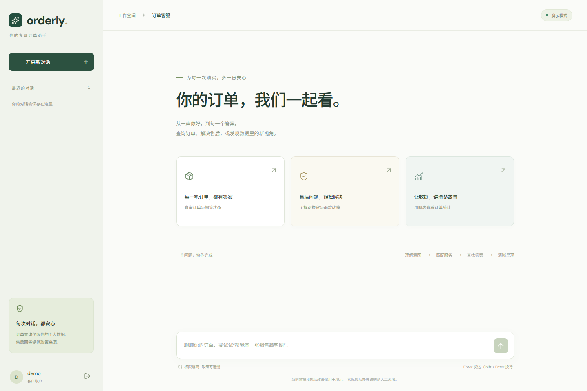
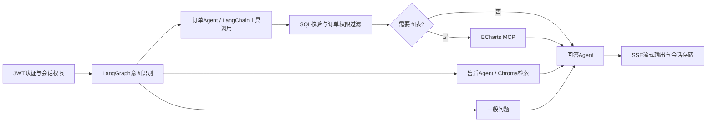

# Orderly · 智能订单 AI 客服助手

基于项目截图功能描述的独立复现：LangGraph 多 Agent 工作流、LangChain Text-to-SQL、ChromaDB 售后 RAG、ECharts MCP、SSE 流式输出、JWT 权限及持久化多会话。截图没有原始源码或 UI，本仓库实现对应功能，并设计了独立的 Vue 客服界面。



## 快速开始

### Docker 一键启动（PostgreSQL）

需要 Docker Engine / Docker Desktop 与 Compose v2。

```bash
cp .env.example .env
docker compose up -d --build
```

访问 http://localhost:8080 。默认演示数据共 72 笔订单，时间范围为 2025 年 1 月至 2 月，和截图项目时间对应。

| 账户 | 密码 | 权限 |
|---|---|---|
| demo | Demo123! | 个人订单（48 笔）及个人会话 |
| alice | Demo123! | 个人订单（24 笔）及个人会话 |
| admin | Admin123! | 全部订单；会话仍仅本人可访问 |

演示模式的用户名和密码是公开示例。不要将默认演示服务暴露为真实业务系统。

### Windows 本地启动（SQLite）

需要 Python 3.12、Node.js 22 与 npm。项目自带的 Windows 启动脚本：

```powershell
.\scripts\start.ps1 -Install
```

以后启动运行 `.\scripts\start.ps1`。访问 http://localhost:5173 ，后端文档 http://localhost:8000/docs 。停止前端后脚本会停止它启动的后端。后台服务日志在项目根目录，已排除在版本控制外。

### 手动启动（跨平台）

所有后端命令从**仓库根目录**运行，确保 `.env` 的路径及 `data` 路径一致。

```bash
python3.12 -m venv .venv
source .venv/bin/activate
pip install -r backend/requirements.txt
cp .env.example .env
PYTHONPATH=backend uvicorn app.main:app --host 127.0.0.1 --port 8000
```

另一个终端：

```bash
cd frontend
npm ci
npm run dev
```

PowerShell 中激活环境使用 `.\.venv\Scripts\Activate.ps1`，后端启动前运行 `$env:PYTHONPATH='backend'`。

## 演示模式与真实模型

| 能力 | `DEMO_MODE=true` | `DEMO_MODE=false` |
|---|---|---|
| 意图识别 | 确定性中文规则 | LLM 结构化分类 |
| 订单查询 | 示例意图转 SQL | LangChain 工具调用 Agent，最多 3 次查询尝试 |
| RAG 向量 | 本地字符二元组哈希向量 | 配置的 Embedding 模型 |
| 回答 | 政策片段及模板，分段输出 | 模型原生 token 流 |
| 权限、会话、图表 | 真实数据库、JWT、LangGraph、MCP | 同一实现 |

演示模式不调用模型、不下载 Embedding 权重，无需 API Key。它支持示例查询及基础指代，并不等同于任意自然语言理解。真实模式在 `.env` 设置：

```dotenv
DEMO_MODE=false
JWT_SECRET=替换为至少32字符的随机密钥
ADMIN_PASSWORD=替换为强密码
CUSTOMER_PASSWORD=替换为强密码
OPENAI_API_KEY=你的模型服务密钥
OPENAI_BASE_URL=https://api.openai.com/v1
LLM_MODEL=你的服务支持的对话模型名称
EMBEDDING_MODEL=text-embedding-3-small
CHART_TRANSPORT=stdio
```

服务需要兼容 OpenAI Chat API、工具调用、结构化输出、流式响应和 Embedding API；模型名称由部署者填写。真实模式启动时检查必要配置，缺失则失败。重新启动才会读取环境配置。对已存在用户，更改环境密码**不会覆盖原密码**，首次初始化才建立账户。

真实模式不会自动写入演示订单。请接入订单数据；切换模式不会删除此前数据库中的演示数据，真实业务应使用新的数据库和数据卷。

政策文件在 `backend/policies/`。启动时解析 Markdown、分块、向量化并更新 Chroma 索引，删除过时片段。切换 Embedding 模型会使用独立集合。示例政策仅代表演示商城。

## 试试这些问题

- 查询我的订单
- 查询待支付订单
- 查询订单 SO2025010001
- 我的订单总金额是多少？
- 七天无理由退货需要满足什么条件？
- 退款多久能到账？
- 按分类统计销售额并画柱状图
- 按状态统计销售额并画柱状图
- 每日销售额趋势图
- 上一轮图表后输入：改成饼图

图表控件可在原结果上切换柱状、折线和饼图。柱状及折线支持多个数值 Series，饼图使用第一个数值列。

## 工作流



- `backend/app/graph.py`：共享 State、条件路由、业务节点和回答流。
- `order_agent.py`：真实 LangChain Agent；SQL 查询工具在模型之外执行权限控制。
- `sql_service.py`：SQL AST 校验、函数白名单、100 行上限。普通客户的每处 orders 表引用都替换为带 customer_id 参数的子查询，在聚合之前隔离数据；不信任模型自行添加 WHERE。
- `rag.py`：解析、分块、Embedding、Chroma 持久化检索及来源。
- `mcp_server.py` / `charts.py`：独立 MCP stdio 服务、客户端、返回格式校验、多 Series ECharts Option。
- `main.py`：JWT 接口、用户隔离会话、SSE 事件和数据库历史。
- `auth.py`：Argon2 密码哈希、HS256 JWT；角色从数据库读取，不接受客户端指定。
- `frontend/src/`：Vue 聊天界面、增量 SSE 解析和按需加载图表。

`CHART_TRANSPORT=stdio` 启动包含的真实 MCP 子进程；`local` 直接调用同一转换器，便于本地轻量演示。项目提供的是 ECharts **Option 生成 MCP 服务**，不是远程图片生成服务。

LangGraph 使用 AsyncSqliteSaver 将状态持久化到 `data/checkpoints.db`，消息、图表与查询结果写入业务数据库。生产实例固定为单 worker；内存登录限流与会话互斥为单实例实现，当前不提供多副本分布式协调。

## 数据库与导入

本地默认 SQLite，Docker 默认 PostgreSQL 16。支持 SQLAlchemy URL 切换到 MySQL：

```dotenv
DATABASE_URL=mysql+pymysql://用户名:密码@数据库主机:3306/orderly?charset=utf8mb4
```

数据库需预先存在；应用初始化所需表。真实业务使用独立数据库账户及数据库权限，项目没有数据库迁移框架。首次建表及订单导入账户需要写权限，查询路径拒绝写 SQL，PostgreSQL 同时使用只读事务和 5 秒语句超时。

从 CSV 导入时，字段包括 `order_no,customer_id,product,category,amount,status,created_at`，日期使用 ISO 格式，customer_id 必须是已存在用户。同订单号会跳过，整批以一个事务写入：

```bash
PYTHONPATH=backend python scripts/import_orders.py orders.csv
```

本地已验证 SQLite 的查询与权限实现。PostgreSQL 的容器启动检查在 GitHub CI 中运行；MySQL 接口已实现，但本地没有服务器，尚未做真实数据库联调。

## API 与 SSE

| 方法 | 路径 | 功能 |
|---|---|---|
| GET | `/api/health` | 服务及模式 |
| POST | `/api/auth/login` | JSON 用户名和密码换取 JWT |
| GET | `/api/auth/me` | 当前用户 |
| GET / POST | `/api/conversations` | 会话列表 / 创建会话 |
| GET | `/api/conversations/{id}/messages` | 个人会话历史 |
| POST | `/api/conversations/{id}/chat` | JSON `{"message":"..."}`，返回 SSE |

除登录和健康检查外均需要 `Authorization: Bearer <token>`。SSE 事件包括 `status`, `token`, `data`, `sources`, `chart`, `done`, `error`。POST SSE 使用 fetch 流读取，可携带认证 Header。Nginx 关闭代理缓冲，后端最长生成时间为 180 秒。没有完成事件时界面会提示连接失败。

会话标题自动取首条问题的前 32 个字符。服务端限制同一会话并发，最多 20 个活跃生成请求；接口不会执行真实售后申请或修改订单。

## 验证

```bash
PYTHONPATH=backend pytest backend/tests -q
cd frontend
npm ci
npm run build
npm audit --audit-level=moderate
```

测试涵盖登录、JWT、订单聚合与子查询隔离、越权表达式、危险 SQL、会话隔离、订单 SSE、政策来源、跨轮状态清理、图表多 Series、真实 MCP stdio 往返及重启恢复。无需模型密钥运行。真实供应商模型调用需由部署者配置后验证。

GitHub Actions 自动运行后端测试、前端构建与漏洞扫描，并构建 Docker Compose 服务检查 PostgreSQL 模式健康。当前设备没有 Docker，本地未运行容器构建。

## 上传 GitHub 与在线部署

GitHub 仓库用于托管源码。FastAPI、关系数据库及向量库需要持续运行的服务器，GitHub Pages 无法完整托管本项目。

仓库推送后在有 Docker 的服务器克隆仓库，设置 `.env` 并运行 `docker compose up -d --build`。公网使用时配置域名与 HTTPS 反向代理，保护 `.env` 和数据卷并做备份。不要公开默认演示账户，或将密钥提交到 GitHub。

## 参考

- [LangGraph 流式 API](https://docs.langchain.com/oss/python/langgraph/streaming)
- [LangGraph 持久化](https://docs.langchain.com/oss/python/langgraph/persistence)
- [LangChain Agents](https://docs.langchain.com/oss/python/langchain/agents)
- [FastAPI JWT 安全](https://fastapi.tiangolo.com/tutorial/security/oauth2-jwt/)
- [Chroma Embedding](https://docs.trychroma.com/docs/embeddings/embedding-functions)
- [MCP Python SDK](https://github.com/modelcontextprotocol/python-sdk)
